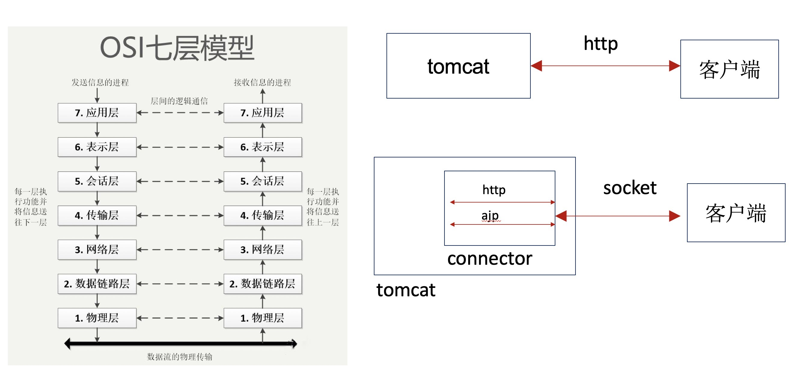

## 模拟实现tomcat
>tomcat按以下的步骤对外提供服务
1. 定义web.xml文件
2. 读取web.xml文件，将配置信息读取到某个地方
3. 定义ServerSocket，持续监听服务
4. 服务到来后处理请求
5. 请求处理完成后返回结果


## 俯视 tomcat

### 前言
> 不了解tomcat的程序员不是好的程序员，tomcat的本质是什么。

### web容器和J2EE容器的区别

- web容器 
    - html 
    - 静态资源 
    - jsp
- J2EE容器
    - 符合J2EE规范的容器


### J2EE规范

- 是什么
    - 建立在java平台的企业级应用解决方案的规范
- 有什么
    - JDBC JSP SERVLET JMS …
    - [传送门](https://www.oracle.com/technetwork/java/javaee/tech/index.html)
    
    
### tomcat 版本介绍
> 点击下图进入官网

[](https://www.oracle.com/technetwork/java/javaee/tech/index.html)

### java代码如何与tomcat合作

- Servlet
    - 它是一套规范，所以它主要的工作就是定义一些接口，每一个接口解决不同的逻辑功能。
- 请求到达tomcat，tomcat的servlet齿轮转动（调用）起来，触发啦servlet的应用代码。

### 网络原理



### tomcat 核心模块


- server: tomcat实例
- Service: connector和container的逻辑分组
- connector: 负责接收请求
- container: 负责处理请求

### tomcat 请求流程


### web.xml

```
<?xml version='1.0' encoding='utf-8'?>
<Server port="8005" shutdown="SHUTDOWN">
  
  <Service name="Catalina">
    
    <Connector port="8080" protocol="HTTP/1.1"
               connectionTimeout="20000"
               redirectPort="8443" />
   
    <Connector port="8443" protocol="org.apache.coyote.http11.Http11Protocol"
               maxThreads="150" SSLEnabled="true" scheme="https" secure="true"
               clientAuth="false" sslProtocol="TLS" />
    -->
    <!-- Define an AJP 1.3 Connector on port 8009 -->
    <Connector port="8009" protocol="AJP/1.3" redirectPort="8443" />
    
    <Engine name="Catalina" defaultHost="localhost">
      
      <Realm className="org.apache.catalina.realm.LockOutRealm">
        <!-- This Realm uses the UserDatabase configured in the global JNDI
             resources under the key "UserDatabase".  Any edits
             that are performed against this UserDatabase are immediately
             available for use by the Realm.  -->
        <Realm className="org.apache.catalina.realm.UserDatabaseRealm"
               resourceName="UserDatabase"/>
      </Realm>
      <Host name="localhost"  appBase="webapps"
            unpackWARs="true" autoDeploy="true">
        
        <Valve className="org.apache.catalina.valves.AccessLogValve" directory="logs"
               prefix="localhost_access_log." suffix=".txt"
               pattern="%h %l %u %t "%r" %s %b" />
      </Host>
    </Engine>
  </Service>
</Server>
```